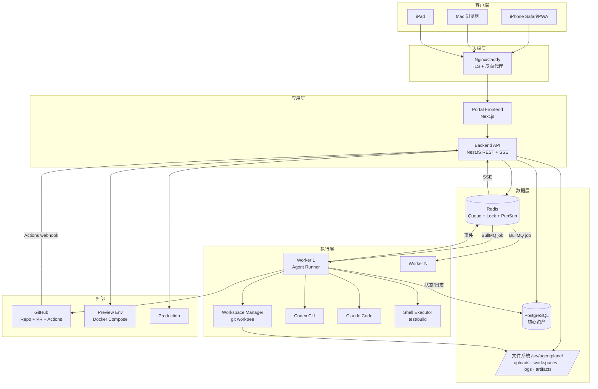
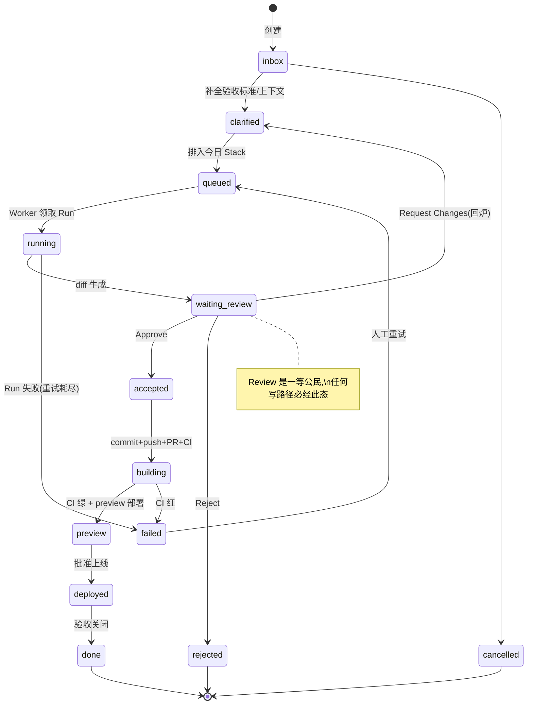
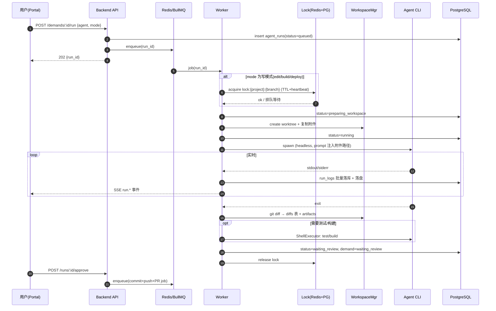
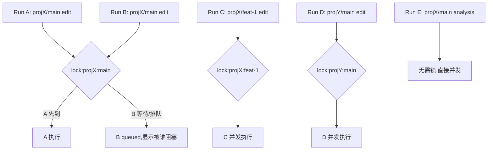
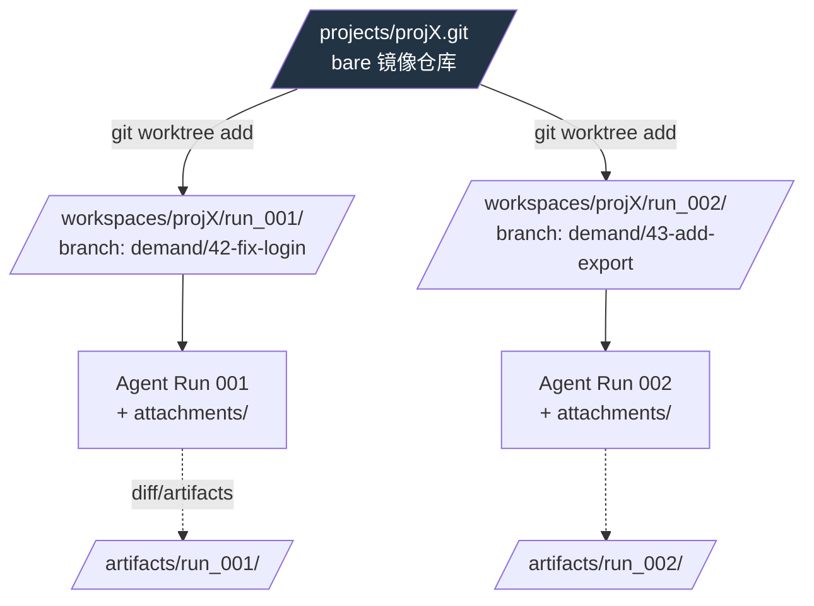

# 02 — System Architecture(系统总架构)

## 1. 逻辑架构图(System Architecture Diagram)



## 2. 运行时架构(进程视图)

单机 MVP 上的进程布局(systemd 管理,详见 runbook):

| 进程 | 数量 | 职责 | 崩溃影响 |
|---|---|---|---|
| nginx | 1 | TLS、静态资源、反代、SSE 透传 | 入口不可用,任务不受影响 |
| portal (next start) | 1 | SSR/静态前端 | UI 不可用 |
| api (node) | 1–2 | REST、SSE、入队、webhook 接收 | 无法下发新任务;运行中任务不受影响 |
| worker (node) | 2–4 | 消费队列、驱动 Agent、git 操作 | 该 worker 的 job 被 BullMQ stalled 检测回收重试 |
| postgres | 1 | 持久化 | 全局只读降级/停摆 |
| redis | 1 | 队列、锁、事件总线 | 新任务停摆;DB 中状态可恢复 |

**关键原则:浏览器/SSH 会话 ↔ 任务执行完全解耦。** 所有长任务只活在 Worker 进程里,客户端只是状态的观察者。

## 3. 数据流图

```mermaid
flowchart LR
    U[用户] -->|1. 创建 Demand+附件| API
    API -->|2. 写 demands/attachments| PG[(PostgreSQL)]
    API -->|3. 附件落盘| UP[/uploads//]
    U -->|4. Run| API -->|5. enqueue| Q[(Redis Queue)]
    Q -->|6. job| W[Worker]
    W -->|7. 取锁| L[(Redis Lock)]
    W -->|8. worktree| WS[/workspaces/{proj}/{run}//]
    UP -->|9. 复制附件| WS
    W -->|10. 启动 Agent| A[Codex/Claude]
    A -->|stdout/stderr| W -->|11. 日志落盘+事件| LOG[/logs//] & EV[(Redis PubSub)]
    EV -->|12. SSE| U
    W -->|13. git diff| PG
    U -->|14. Approve| API --> W2[Worker] -->|15. commit/push/PR| GH[GitHub]
    GH -->|16. CI webhook| API --> PG
    U -->|17. Deploy| API --> Q --> W3[Worker] --> ENV[Preview/Staging/Prod]
```

## 4. Demand 生命周期(State Machine)



合法迁移之外的一切状态变更必须拒绝(API 层校验 + DB trigger 兜底)。

## 5. Agent Run 生命周期(Sequence Diagram)



## 6. Attachment 上传与映射流程

```
1. Portal 多端上传(iPhone 相册/文件) → POST /demands/:id/attachments (multipart)
2. API 校验:大小≤50MB、MIME 白名单、文件名 sanitize、计算 sha256
3. 落盘:/srv/agentplane/uploads/{yyyy}/{mm}/{sha256}.{ext}(内容寻址,天然去重)
4. 写 demand_attachments(原始文件名、mime、size、sha256、storage_path)
5. Run 准备阶段:Workspace Manager 将该 Demand 全部附件
   复制到 {workspace}/attachments/{原始安全文件名}
6. Prompt 生成器注入清单:
   "用户提供了以下附件,位于 ./attachments/:
    - bug-screenshot.png (image/png, 1.2MB)
    - error.log (text/plain, 40KB)"
7. Agent 在 workspace 内以相对路径读取(图片由支持视觉的 agent 直接读)
```

复制而非软链:防止 Agent 篡改 uploads 原件,且 workspace 删除不影响原件。

## 7. Log Streaming 流程

```
Agent stdout/stderr
  → Worker pty/pipe 捕获,按行解析
  → ① 追加 /srv/agentplane/logs/{run_id}.log(原始全量,审计源)
  → ② 批量(200ms/50行)写 run_logs 表(可搜索)
  → ③ 脱敏后 publish Redis channel run:{run_id}:events
API 订阅 channel → SSE 推送 GET /runs/:id/events
前端 EventSource 渲染;断线重连带 Last-Event-ID,从 run_logs 补齐缺口
```

详见 [15 事件设计 → 文档 02 第 7 节 + run_logs/事件 schema 在 03/15 相关章节]。

## 8. Diff Review 流程

```
Run 结束 → worker 在 workspace 执行:
  git add -A && git diff --staged --binary > patch
  git diff --staged --stat → 摘要
→ 存 diffs 表(patch 全文 ≤1MB 入库,超出存 artifacts 并入库引用)
→ Demand → waiting_review,Portal 推送通知
→ 审核页:文件树 + 逐文件 diff(只读 Monaco)+ Agent 运行摘要 + 测试结果
→ Accept:写 approvals → 入队 commit job
→ Reject:approvals 记录,workspace 标记可清理,Demand → rejected
→ Request Changes:评论写回 demand_comments,Demand → clarified,
  下一次 Run 的 prompt 自动携带审核意见
```

## 9. CI/CD Pipeline Diagram

```mermaid
flowchart LR
    D[Demand<br/>accepted] --> C[commit<br/>工作区内提交]
    C --> P[push<br/>demand/{id}-{slug} 分支]
    P --> PR[创建 PR<br/>GitHub API]
    PR --> CI[GitHub Actions<br/>lint/test/build]
    CI -->|webhook 回写| ST{CI 结果}
    ST -->|绿| PV[Preview 部署<br/>docker compose -p preview-{id}]
    ST -->|红| FB[写回 Demand=failed<br/>日志附到 run]
    PV --> AP{人工批准}
    AP -->|staging| SG[Staging 部署]
    SG --> AP2{人工批准<br/>critical 双人}
    AP2 --> PD[Production 部署]
    PD --> AU[Audit + Deployment 记录]
    PD -.->|rollback| RB[回滚到上一 deployment]
```

## 10. 多用户并发控制流程



规则:**写互斥粒度 = project_id + branch**;analysis(只读)永不取锁;跨 project / 跨 branch 自由并发。每个 Run 独占 workspace,物理上不可能互写。

## 11. Workspace Isolation Diagram



## 12. SSH / tmux 与 Portal 的关系

- **Portal 是主路径**:日常 100% 操作经 Portal,任务生命周期不依赖任何终端会话。
- **SSH 是逃生通道(break-glass)**:仅用于运维(systemd、磁盘、数据库)与故障排查;SSH 下手动改 workspace 属于越权操作,会被 audit 检测(workspace 的 git status 与 run 记录不一致时告警)。
- **tmux 的角色降级**:不再承担"任务持久化"(由 Worker+Queue 承担)。可选保留:worker 以 systemd 运行;调试时 `journalctl -u agentplane-worker -f` 替代 tmux attach。Phase 0 过渡期可用 tmux 跑 worker,Phase 3 起必须 systemd。
- 明确**不做** Web Terminal 直通 shell(安全边界,见 09)。需要 shell 时走 SSH,且生产 deploy 不允许从 shell 绕过审批链。

## 13. 关键设计原则(Normative,15 条)

以下原则为强约束,违反需走 ADR:

1. **CLI Agent 不是系统核心**,只是 Worker 的一个可替换 executor(AgentExecutor 接口)。
2. **Demand / Run / Workspace / Diff / Approval / Deployment 是核心资产**,全部持久化于 PostgreSQL,生命周期独立于任何进程。
3. 一个 Demand 可产生 **多个 Agent Run**(重试、Request Changes 回炉、分阶段执行)。
4. 一个 Agent Run **必须绑定唯一独立 Workspace**;Run 间禁止共享工作目录。
5. **写任务必须先取 Project Lock**,取不到则排队,不得抢占。
6. **同一 project + branch 同时只允许一个写任务**(edit/build/deploy)。
7. 不同 project 或不同 branch **可以并发**。
8. 所有附件必须 **复制**(MVP)或只读挂载到当前 Run Workspace,Agent 不得访问 uploads 原始目录。
9. **Agent 进程环境中永不出现生产 secrets**;deploy 凭据只存在于 deploy 专用 worker 路径,与 agent 环境隔离。
10. **Dangerous mode**(跳过命令确认,如 `--dangerously-skip-permissions`)只允许在隔离 workspace + 非生产 + 风险等级 ≤ medium 时启用。
11. 所有命令、日志、diff、审批 **全量可追踪**:run_steps + run_logs + audit_logs 三层记录。
12. **Web API 不执行长任务**:任何 >2s 的工作必须入队由 Worker 执行,API 立即返回 202 + run_id。
13. **Deploy 与 Code Edit 分离**:不同 RunMode、不同审批门禁、不同凭据域;一个 Run 不得既改代码又部署。
14. **Review/Approval 是一等公民**:任何写路径(commit/push/deploy)必须存在对应 approvals 记录,API 层强制校验。
15. 系统必须支持 **替换/新增 Agent**:新 agent = 新 AgentProfile + 新 Executor 实现,零核心改动。

## 14. 技术选型(MVP 推荐组合,单一明确)

| 层 | 选型 | 理由 |
|---|---|---|
| Frontend | **Next.js 14+(App Router)+ TypeScript + Tailwind + shadcn/ui** | 移动端 PWA 友好;shadcn 快速产出审核/表单类 UI |
| 日志视图 | **虚拟滚动日志组件(自研轻量)+ xterm.js 备选** | 日志是只读流,xterm 仅在需要 ANSI 渲染时启用 |
| Diff | **Monaco Diff(只读)**,移动端 unified 自渲染 | 成熟、零成本 |
| Backend | **NestJS(Node 20+)+ REST + SSE** | 与 Worker 同语言共享 `packages/shared` 类型与状态机常量——这是选 Node 全栈最大理由;SSE 比 WS 简单且过 nginx 友好,日志单向流足够 |
| ORM | **Drizzle** | 类型安全、迁移轻、SQL 贴近(本系统 SQL 约束多) |
| DB | **PostgreSQL 16** | 不解释 |
| Queue | **Redis 7 + BullMQ** | stalled-job 检测正好覆盖 worker crash 恢复;delayed retry 覆盖锁等待 |
| Worker | **Node 20 + node-pty + systemd-run scope 资源限制** | pty 保证 CLI 行为正常;cgroup 限额 |
| Workspace | **bare mirror + git worktree per run** | 见 05 |
| CI/CD | **GitHub Actions + PAT(MVP)→ GitHub App**;**Docker Compose** 做 preview/staging | 见 10 |
| 入口 | **Caddy**(自动 TLS)或 Nginx | 单机省心 |
| 进程管理 | **systemd**(portal/api/worker 各一 unit) | tmux 退役为调试工具 |

> 替代路线说明:FastAPI+Celery(Python)亦可行,但会造成 API/Worker 与前端类型割裂、状态机常量双份维护,故不取。tRPC 不取:REST 便于未来开放 API 与 webhook 生态。

## 15. Monorepo 目录结构

```
agentplane/                      # 仓库根(pnpm workspace + turborepo)
├── apps/
│   ├── portal/                 # Next.js 前端(08)
│   ├── api/                    # NestJS:REST、SSE、webhook、auth(07/09)
│   └── worker/                 # BullMQ 消费者:Agent Runner、git/CI/deploy jobs(04)
├── packages/
│   ├── shared/                 # 类型、状态机定义与合法迁移表、错误码、zod schema(单一事实源)
│   ├── db/                     # Drizzle schema + migrations + seed(03)
│   ├── agent-runner/           # AgentExecutor 接口与 Codex/Claude/Shell 实现、policies(04)
│   ├── workspace-manager/      # worktree/附件/diff/gc(05)
│   ├── ci/                     # GitHub API client、webhook 验签、compose preview 驱动(10)
│   ├── auth/                   # session、RBAC guard、rate limit(09)
│   └── ui/                     # 跨页面组件:状态徽章、日志视图、diff 视图(08)
├── infra/
│   ├── docker/                 # compose.dev.yml(pg+redis)、compose.preview 模板
│   ├── nginx/                  # 或 Caddyfile:TLS、SSE 透传(proxy_buffering off)
│   ├── systemd/                # agentplane-api/worker/portal.service 模板
│   └── scripts/                # bootstrap.sh、backup.sh、gc.sh
├── docs/
│   ├── architecture/           # 本套文档
│   ├── adr/                    # 架构决策记录
│   └── runbooks/               # 运维手册
└── (服务器运行时目录 /srv/agentplane/{projects,workspaces,uploads,logs,artifacts} 不在 repo 内,见 05)
```

职责边界:apps 只做装配与 IO,业务规则全部在 packages(可单测);跨层只允许 apps→packages、packages→shared 方向依赖。
