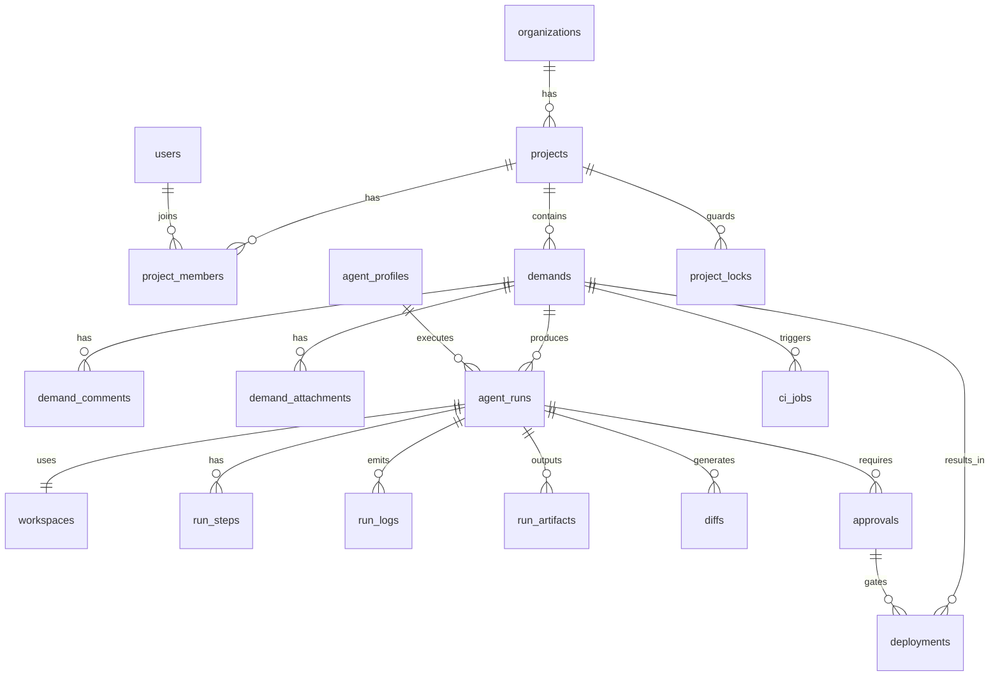

# 03 — Data Model(数据模型,PostgreSQL)

## 0. 约定

- 主键统一 `id UUID PRIMARY KEY DEFAULT gen_random_uuid()`
- 时间统一 `TIMESTAMPTZ`,所有表含 `created_at DEFAULT now()`;可变表含 `updated_at`
- 软删除仅用于 users/projects(`deleted_at`);流程类记录(runs/logs/approvals/audit)**永不删除**
- 枚举用 PG `ENUM` 类型;状态迁移由应用层校验 + 触发器兜底
- ORM:Drizzle(见 06 技术选型);以下为语义 DDL

## 1. 状态枚举(State Machines)

```sql
CREATE TYPE demand_status AS ENUM (
  'inbox','clarified','queued','running','waiting_review',
  'accepted','rejected','building','preview','deployed',
  'done','failed','cancelled');

CREATE TYPE agent_run_status AS ENUM (
  'queued','preparing_workspace','running','waiting_user_input',
  'waiting_review','succeeded','failed','cancelled','timed_out');

CREATE TYPE run_mode AS ENUM ('analysis','edit','test','build','deploy');

CREATE TYPE approval_status AS ENUM ('pending','accepted','rejected','changes_requested');

CREATE TYPE deployment_status AS ENUM ('pending','deploying','succeeded','failed','rolled_back');

CREATE TYPE risk_level AS ENUM ('low','medium','high','critical');

CREATE TYPE lock_status AS ENUM ('held','released','expired','force_released');

CREATE TYPE ci_status AS ENUM ('pending','queued','in_progress','success','failure','cancelled');

CREATE TYPE member_role AS ENUM ('viewer','developer','reviewer','admin','owner');
```

**Demand 合法迁移表**(应用层常量 + `demand_status_transitions` 校验函数):

| from | to |
|---|---|
| inbox | clarified, cancelled |
| clarified | queued, cancelled |
| queued | running, cancelled |
| running | waiting_review, failed, cancelled |
| waiting_review | accepted, rejected, clarified |
| accepted | building |
| building | preview, failed |
| preview | deployed, failed |
| deployed | done |
| failed | queued (人工重试) |

**AgentRun 合法迁移**:queued → preparing_workspace → running → {waiting_user_input ↔ running} → {waiting_review | succeeded | failed | cancelled | timed_out};waiting_user_input 超时 → timed_out。

## 2. 表设计

### 2.1 users
| 字段 | 类型 | 说明 |
|---|---|---|
| id | UUID PK | |
| email | CITEXT UNIQUE NOT NULL | 登录名 |
| password_hash | TEXT | argon2id;SSO 用户可空 |
| display_name | TEXT NOT NULL | |
| is_active | BOOL DEFAULT true | |
| is_superadmin | BOOL DEFAULT false | 系统级管理员 |
| last_login_at | TIMESTAMPTZ | |
| deleted_at | TIMESTAMPTZ | 软删除 |

索引:`UNIQUE(email)`。约束:deleted 用户不可登录(应用层)。

### 2.2 organizations
| 字段 | 类型 | 说明 |
|---|---|---|
| id | UUID PK | |
| slug | TEXT UNIQUE NOT NULL | URL 安全,`^[a-z0-9-]{2,40}$` |
| name | TEXT NOT NULL | |
| settings | JSONB DEFAULT '{}' | org 级配置覆盖 |

MVP 单 org(seed 一条),模型即多租户就绪。

### 2.3 projects
| 字段 | 类型 | 说明 |
|---|---|---|
| id | UUID PK | |
| org_id | UUID FK→organizations | |
| slug | TEXT NOT NULL | 用于路径 `/workspaces/{slug}/`,`^[a-z0-9-]{2,40}$`,**CHECK 强校验防路径穿越** |
| name | TEXT NOT NULL | |
| repo_url | TEXT NOT NULL | git 远程地址 |
| default_branch | TEXT DEFAULT 'main' | |
| bare_repo_path | TEXT | `/srv/agentplane/projects/{slug}.git` |
| risk_level | risk_level DEFAULT 'medium' | 项目基线风险 |
| allow_dangerous_mode | BOOL DEFAULT false | |
| ci_provider | TEXT DEFAULT 'github_actions' | |
| settings | JSONB DEFAULT '{}' | test/build 命令、preview 配置等 |
| deleted_at | TIMESTAMPTZ | |

索引:`UNIQUE(org_id, slug)`。

### 2.4 project_members
| 字段 | 类型 | 说明 |
|---|---|---|
| id | UUID PK | |
| project_id | UUID FK→projects ON DELETE CASCADE | |
| user_id | UUID FK→users | |
| role | member_role NOT NULL | viewer<developer<reviewer<admin<owner |

索引:`UNIQUE(project_id, user_id)`、`(user_id)`。

### 2.5 demands
| 字段 | 类型 | 说明 |
|---|---|---|
| id | UUID PK | |
| project_id | UUID FK→projects | |
| number | INT NOT NULL | 项目内自增展示编号(序列 per project) |
| title | TEXT NOT NULL CHECK(length≤200) | |
| description | TEXT | Markdown |
| acceptance_criteria | TEXT | Markdown checklist,Agent prompt 必注入 |
| context_files | TEXT[] DEFAULT '{}' | 仓库内相关文件路径提示 |
| target_branch | TEXT NOT NULL | 基线分支 |
| work_branch | TEXT | 生成的 `demand/{number}-{slug}` |
| priority | SMALLINT DEFAULT 3 | 1(最高)–5 |
| labels | TEXT[] DEFAULT '{}' | GIN 索引 |
| target_agent_profile_id | UUID FK→agent_profiles | 可空=用项目默认 |
| run_mode | run_mode DEFAULT 'edit' | |
| risk_level | risk_level DEFAULT 'medium' | |
| status | demand_status DEFAULT 'inbox' | |
| owner_id | UUID FK→users | |
| reviewer_id | UUID FK→users | 可空 |
| parent_demand_id | UUID FK→demands | 拆分来源 |
| linked_pr_url | TEXT | |
| linked_deployment_id | UUID FK→deployments | |
| scheduled_date | DATE | 进入哪天的 Daily Stack |
| stack_order | INT | 当日栈内顺序 |
| retry_count | SMALLINT DEFAULT 0 | |
| failure_reason | TEXT | |

索引:`UNIQUE(project_id, number)`、`(project_id, status)`、`(scheduled_date, stack_order)`、`(owner_id)`、GIN(labels)。
约束:`reviewer_id <> owner_id`(critical 风险时应用层强制);status 迁移触发器校验。

### 2.6 demand_comments
| 字段 | 类型 |
|---|---|
| id | UUID PK |
| demand_id | UUID FK→demands ON DELETE CASCADE |
| author_id | UUID FK→users(NULL=系统/agent) |
| kind | TEXT CHECK IN ('user','system','review_feedback','agent') |
| body | TEXT NOT NULL |

索引:`(demand_id, created_at)`。review_feedback 类型评论会被注入下一次 Run prompt。

### 2.7 demand_attachments
| 字段 | 类型 | 说明 |
|---|---|---|
| id | UUID PK | |
| demand_id | UUID FK→demands | |
| uploader_id | UUID FK→users | |
| original_filename | TEXT NOT NULL | 仅展示用 |
| safe_filename | TEXT NOT NULL | sanitize 后,workspace 内使用 |
| mime_type | TEXT NOT NULL | 白名单校验后 |
| size_bytes | BIGINT CHECK(>0 AND ≤52428800) | ≤50MB |
| sha256 | TEXT NOT NULL | 内容寻址 |
| storage_path | TEXT NOT NULL | `/uploads/{yyyy}/{mm}/{sha256}.{ext}` |

索引:`(demand_id)`、`(sha256)`。

### 2.8 agent_runs
| 字段 | 类型 | 说明 |
|---|---|---|
| id | UUID PK | |
| demand_id | UUID FK→demands | |
| project_id | UUID FK→projects | 冗余加速查询 |
| agent_profile_id | UUID FK→agent_profiles | |
| run_mode | run_mode NOT NULL | |
| status | agent_run_status DEFAULT 'queued' | |
| attempt | SMALLINT DEFAULT 1 | 重试序号 |
| triggered_by | UUID FK→users | |
| workspace_id | UUID FK→workspaces | 准备后回填 |
| lock_id | UUID FK→project_locks | 写模式回填 |
| prompt | TEXT | 实际发给 agent 的完整 prompt(审计) |
| dangerous_mode | BOOL DEFAULT false | |
| exit_code | INT | |
| started_at / finished_at | TIMESTAMPTZ | |
| timeout_seconds | INT DEFAULT 3600 | |
| token_usage | JSONB | 成本统计 |
| error_message | TEXT | |

索引:`(demand_id, attempt)`、`(status)`、`(project_id, created_at DESC)`。
约束:`finished_at >= started_at`;dangerous_mode=true 时应用层校验 project.allow_dangerous_mode 且 risk≤medium。

### 2.9 run_steps
| 字段 | 类型 | 说明 |
|---|---|---|
| id | UUID PK | |
| run_id | UUID FK→agent_runs ON DELETE CASCADE | |
| seq | INT NOT NULL | 步骤序 |
| name | TEXT | acquire_lock / prepare_workspace / copy_attachments / agent_exec / run_tests / collect_diff / cleanup |
| status | TEXT CHECK IN ('pending','running','succeeded','failed','skipped') | |
| command | TEXT | 实际执行命令(脱敏后) |
| exit_code | INT | |
| started_at / finished_at | TIMESTAMPTZ | |
| meta | JSONB | |

索引:`UNIQUE(run_id, seq)`。这是 Run Detail 页 timeline 的数据源。

### 2.10 run_logs
| 字段 | 类型 | 说明 |
|---|---|---|
| id | BIGSERIAL PK | 高写入量,用 bigserial 非 UUID |
| run_id | UUID FK→agent_runs | |
| step_id | UUID FK→run_steps NULL | |
| seq | BIGINT NOT NULL | run 内单调递增,SSE Last-Event-ID 续传锚点 |
| stream | TEXT CHECK IN ('stdout','stderr','event') | |
| content | TEXT NOT NULL | 已脱敏 |
| ts | TIMESTAMPTZ DEFAULT now() | |

索引:`UNIQUE(run_id, seq)`、`(run_id, ts)`;可选 `content` GIN(pg_trgm) 支持搜索。
保留策略:90 天后归档到文件并删行(原始 .log 文件永久保留至 retention)。

### 2.11 run_artifacts
| 字段 | 类型 |
|---|---|
| id | UUID PK |
| run_id | UUID FK→agent_runs |
| kind | TEXT CHECK IN ('diff','test_report','build_output','coverage','screenshot','other') |
| filename | TEXT NOT NULL |
| storage_path | TEXT NOT NULL — `/artifacts/{run_id}/...` |
| size_bytes | BIGINT |
| sha256 | TEXT |

索引:`(run_id)`。

### 2.12 workspaces
| 字段 | 类型 | 说明 |
|---|---|---|
| id | UUID PK | |
| run_id | UUID UNIQUE FK→agent_runs | 1:1 |
| project_id | UUID FK→projects | |
| path | TEXT UNIQUE NOT NULL | `/workspaces/{slug}/{run_id}/` |
| kind | TEXT CHECK IN ('worktree','clone','docker') DEFAULT 'worktree' | |
| base_branch | TEXT NOT NULL | |
| work_branch | TEXT NOT NULL | |
| base_commit | TEXT NOT NULL | 创建时 HEAD,diff 基线 |
| status | TEXT CHECK IN ('creating','ready','in_use','dirty','cleaned','failed') | |
| cleaned_at | TIMESTAMPTZ | |

索引:`(project_id, status)`。约束:path 必须以配置根目录开头(应用层 realpath 校验)。

### 2.13 project_locks
| 字段 | 类型 | 说明 |
|---|---|---|
| id | UUID PK | |
| project_id | UUID FK→projects | |
| branch | TEXT NOT NULL | |
| lock_key | TEXT NOT NULL | `lock:{project_id}:{branch}` |
| holder_run_id | UUID FK→agent_runs | |
| holder_worker_id | TEXT | worker 实例标识 |
| reason | TEXT | |
| status | lock_status DEFAULT 'held' | |
| acquired_at | TIMESTAMPTZ DEFAULT now() | |
| expires_at | TIMESTAMPTZ NOT NULL | TTL |
| last_heartbeat_at | TIMESTAMPTZ | |
| released_at | TIMESTAMPTZ | |
| released_by | UUID FK→users NULL | 手动释放者 |

索引:**部分唯一索引** `UNIQUE(project_id, branch) WHERE status='held'` ——数据库层兜底"同 project+branch 最多一把活锁";`(holder_run_id)`。
注:Redis 为锁的运行时真相,本表为持久审计与崩溃恢复依据(见 09 锁设计章节/文档 02)。

### 2.14 approvals
| 字段 | 类型 | 说明 |
|---|---|---|
| id | UUID PK | |
| run_id | UUID FK→agent_runs | |
| demand_id | UUID FK→demands | |
| kind | TEXT CHECK IN ('diff_review','staging_deploy','production_deploy') | |
| status | approval_status DEFAULT 'pending' | |
| requested_at | TIMESTAMPTZ DEFAULT now() | |
| decided_at | TIMESTAMPTZ | |
| reviewer_id | UUID FK→users | |
| comment | TEXT | |
| diff_id | UUID FK→diffs NULL | 审的是哪个 diff |

索引:`(run_id)`、`(status) WHERE status='pending'`。
约束:production_deploy + risk=critical 需两条 accepted 记录且 reviewer 互异(应用层)。

### 2.15 diffs
| 字段 | 类型 | 说明 |
|---|---|---|
| id | UUID PK | |
| run_id | UUID FK→agent_runs | |
| base_commit | TEXT NOT NULL | |
| patch | TEXT | ≤1MB 入库 |
| patch_artifact_id | UUID FK→run_artifacts | 超大 patch 落盘引用 |
| files_changed / insertions / deletions | INT | |
| summary | JSONB | per-file stat,前端文件树数据源 |
| is_empty | BOOL DEFAULT false | |

索引:`(run_id)`。约束:`patch IS NOT NULL OR patch_artifact_id IS NOT NULL OR is_empty`。

### 2.16 ci_jobs
| 字段 | 类型 | 说明 |
|---|---|---|
| id | UUID PK | |
| demand_id | UUID FK→demands | |
| run_id | UUID FK→agent_runs NULL | |
| provider | TEXT DEFAULT 'github_actions' | |
| external_id | TEXT | Actions run id |
| external_url | TEXT | |
| ref | TEXT | 分支/sha |
| status | ci_status DEFAULT 'pending' | |
| conclusion_detail | JSONB | 各 job 明细 |
| started_at / finished_at | TIMESTAMPTZ | |

索引:`(demand_id)`、`UNIQUE(provider, external_id)`。

### 2.17 deployments
| 字段 | 类型 | 说明 |
|---|---|---|
| id | UUID PK | |
| demand_id | UUID FK→demands | |
| project_id | UUID FK→projects | |
| environment | TEXT CHECK IN ('preview','staging','production') | |
| status | deployment_status DEFAULT 'pending' | |
| commit_sha | TEXT NOT NULL | |
| approval_id | UUID FK→approvals | staging/prod 必填(应用层) |
| deployed_by | UUID FK→users | |
| url | TEXT | preview/正式地址 |
| rollback_of | UUID FK→deployments NULL | 回滚指向 |
| started_at / finished_at | TIMESTAMPTZ | |
| logs_artifact_id | UUID FK→run_artifacts | |

索引:`(project_id, environment, created_at DESC)`。
约束:同 project+environment 同时只允许一个 status='deploying'(部分唯一索引)。

### 2.18 audit_logs(append-only)
| 字段 | 类型 | 说明 |
|---|---|---|
| id | BIGSERIAL PK | |
| actor_id | UUID FK→users NULL | NULL=系统 |
| actor_ip | INET | |
| action | TEXT NOT NULL | `demand.create` `run.approve` `deploy.production` `lock.force_release` ... |
| resource_type / resource_id | TEXT / UUID | |
| payload | JSONB | 脱敏后的请求关键字段 |
| ts | TIMESTAMPTZ DEFAULT now() | |

索引:`(resource_type, resource_id)`、`(actor_id, ts)`、`(action)`。
约束:`REVOKE UPDATE, DELETE ON audit_logs FROM app_role`(数据库层不可篡改)。

### 2.19 agent_profiles
| 字段 | 类型 | 说明 |
|---|---|---|
| id | UUID PK | |
| slug | TEXT UNIQUE | `codex` `claude-code` `shell` ... |
| name | TEXT | |
| executor | TEXT CHECK IN ('codex','claude','shell') | 映射 Executor 实现 |
| binary_path | TEXT | 如 `/usr/local/bin/claude` |
| default_args | TEXT[] | headless 参数 |
| env_allowlist | TEXT[] | 允许透传给 agent 进程的环境变量名 |
| supports_vision | BOOL DEFAULT false | 能否读图 |
| max_timeout_seconds | INT DEFAULT 7200 | |
| allowed_run_modes | run_mode[] | |
| is_enabled | BOOL DEFAULT true | |
| config | JSONB | model、温度等 |

### 2.20 system_settings
| 字段 | 类型 |
|---|---|
| key | TEXT PK |
| value | JSONB NOT NULL |
| description | TEXT |
| updated_by | UUID FK→users |
| updated_at | TIMESTAMPTZ |

存:全局并发上限、workspace retention 天数、上传 MIME 白名单、脱敏正则集、rate limit 配置等。

## 3. 实体关系总览


